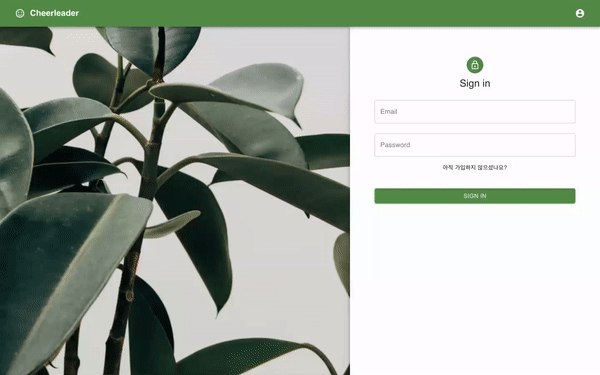

# 프로젝트명: Cheerleader
랜덤으로 응원 메세지를 주고 받을 수 있는 서비스 입니다.

## 프로젝트 정보
  ### 1. 소개
   * 주요 기능 시연 gif
   
   
   
   
   

  ### 2. 주요 기능
  * 회원가입 & 회원탈퇴
  * 로그인 & 로그아웃
  * 메세지 보내기 & 받기
  * 회원 정보 모달창으로 보기
  
  ### 3. 사용 스택
  * 프론트엔드
    * React & React Hook
    * Axios
    * Material-UI
    
  * 백엔드
    * Node.js & Express
    * JWT
    * MySQl
  
  * DB
    * AWS - S3
    * AWS - EC2
    * AWS - RDS
    
    
 
  

