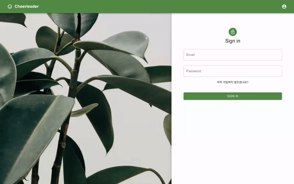
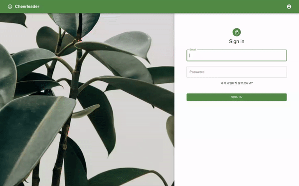
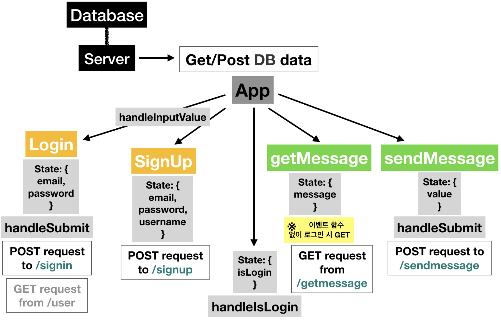
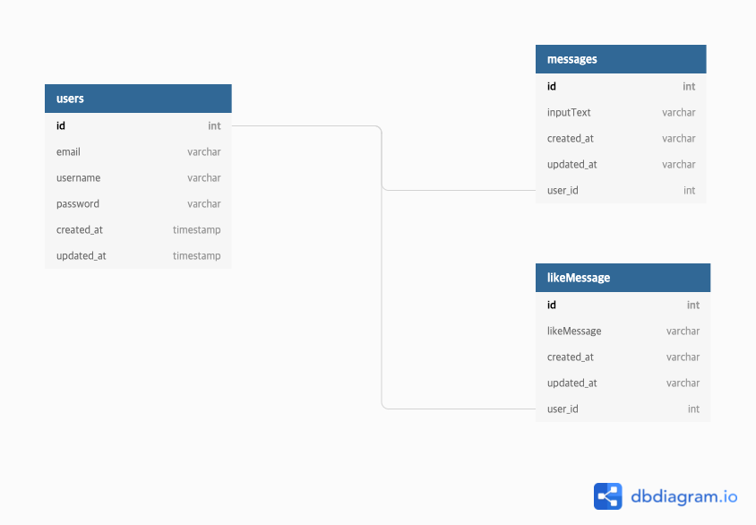

# 팀명: Console 😀

### 팀 소개

| Member   |     Role      |  GitHub |
|:----------|:-------------:|:------:|
|형광석|Front-End|[michael00987](https://github.com/michael00987)|
|홍영란|Front-End|[YounglanHong](https://github.com/YounglanHong)|
|박성택|Back-End|[stoic-park](https://github.com/stoic-park)|
|박성용|Back-End|[Woody-Park](https://github.com/Woody-Park)|

# 프로젝트명: Cheerleader


## 프로젝트 정보

### 0. 소개

랜덤으로 응원 메세지를 주고 받을 수 있는 서비스를 제공하는 웹 어플리케이션 입니다.

※ 배포 링크: https://cheerleader-cbe82.web.app/

### 1. 설치 및 사용 방법

(1) 코드 복사

> 본 레파지토리를 https://github.com/YounglanHong/FirstProject_Cheerleader 주소를 활용하여 로컬 환경에 clone 합니다.

```js
git clone https://github.com/YounglanHong/FirstProject_Cheerleader
```

(2) 패키지 설치

```js
npm install
```

(3) 실행

```js
// cheerleader-client
cd client
npm start

// cheerleader-server
npm start
```

### 2. 디렉토리 구조

- cheerleader-client

```
├── src/
     └── components/
     |    ├──  GetMsg/
     |    ├──  Login/
     |    ├──  SendMsg/
     |    └──  Signup/
     |
     ├── css/
     ├── App.js
     ├── App.css
     ├── index
     └── index.css
```

- cheerleader-server

```
└── controller/
     └── messege/
     |    ├──  getMessage/
     |    ├──  getMessageList/
     |    ├──  index/
     |    └──  sendMessage/
     └── user/
     |    ├──  index/
     |    ├──  info/
     |    ├──  infoUpdate/
     |    ├──  logout/
     |    ├──  signin/
     |    ├──  signup/
     |    └──  withDrawal/
     |
     ├── index/
     |
     ├── migrations/
     |
     ├── models/
     |    ├──  index/
     |    ├──  messages/
     |    └──  users/
     |
     ├── routes/
     |    ├── message/
     |    └── user/
     |
     └── index
```

### 3. 주요 기능

  - 회원가입
  
  
  
  - 유효성검사
  
  
  
  - 로그인
  
  
  
  - 메세지페이지
  
  

  - 회원 정보 모달창으로 보기
  - 로그아웃, 회원탈퇴
  
  
  

### 4. 사용 스택

- 프론트엔드

  - React & React Hook
  - Axios
  - Material-UI

- 백엔드

  - Node.js & Express
  - JWT
  - MySQl

- DB
  - AWS - S3
  - AWS - EC2
  - AWS - RDS

***

### 5. Data flow



### 6. DB Schema


